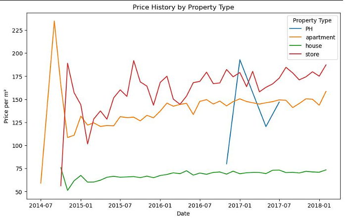

# This Website is under building process :)
# Data Analyst | Business Analyst

## Education

  Post-Degree in Artificial Intelligence at the University of Winnipeg  

B.A. in Information Technology at Michigan State University  

B.A. in Finance at Michigan State University  
 
## Certificate

IBM Data Science Professional Certificate  

Snowflake Warehousing Certificate   

Google Cybersecurity Certificate  

Bloomberg Terminal Certificate   

## Core Competencies 
**Programming:** Python (Pandas, NumPy, Scikit-Learn), Pine Script, SQL  
**Financial Analysis:** Bloomberg Terminal, Schwab Thinkorswim, TradingView  
**Cloud & Big Data**: Google Cloud Platform, Snowflake, Apache Hadoop, Apache Spark  
**Data Analytics:** Excel (VLOOKUP, Pivot Tables), SQL, data visualization (Tableau, Power BI)  
**Business Analysis:** Requirement gathering, stakeholder engagement, business process mapping  
**Data Engineering & Automation**: Apache Airflow, Apache Kafka, ETL Pipelines  
**Project Management**: JIRA, SharePoint, Microsoft Visio, project planning, Slack, AirTable, Fireflies  

## Work Experience
  
### **Quantitative Analyst  - Grand River Corporation**  
July 2020 - January 2024    

  
  
As a Quantitative Analyst at Grand River Corporation, I specialized in developing sophisticated financial models and optimizing investment strategies through comprehensive data analysis. My expertise in Python facilitated significant automation of trading workflows, enhancing operational efficiency, reducing manual tasks, and increasing the accuracy of data processing. This automation not only streamlined operations but also supported the scalability of trading activities.
  
  
  
Utilizing advanced trading platforms such as TradingView and Thinkorswim, I engaged in financial derivatives trading which played a pivotal role in advancing our clients' portfolios. These platforms enabled precise analysis and execution of complex trading strategies, integrating seamlessly with our existing systems to bolster our analytical capabilities.
  
  
  
I also created and maintained actionable dashboards using Tableau and Power BI, providing leadership with clear, visual insights into market data and trends. This was crucial for facilitating strategic discussions and enabling quick, informed decision-making. My rigorous market analysis helped unearth underlying trends, informing investment decisions that optimized our long-term financial strategy.
  
Furthermore, I was responsible for the design and implementation of algorithmic trading strategies that directly contributed to a significant enhancement in portfolio performance, achieving a 17.25% increase in returns and improving risk-adjusted metrics. These strategies, coupled with my role in process automation, were integral to maintaining a competitive advantage in a fast-paced financial environment.
  
-------------------------------------------------------------------------  

  
### **AI Coding Quality Assurance Specialist  - Outlier**  
November 2024 - Present  
  
Since November 2024, I have been working as an AI Coding Quality Assurance Specialist at Outlier. My role involves conducting data-driven analyses and developing automated testing frameworks to enhance the operational reliability of the client's systems. This approach has successfully improved system accuracy by 23%.
  
In addition to these responsibilities, I actively monitor system performance metrics to identify patterns and gather insights. This meticulous tracking aids in proactive issue resolution and facilitates continuous improvement across our projects.
  
Furthermore, I collaborate with cross-functional teams to troubleshoot AI model performance issues. Together, we devise and implement corrective actions, ensuring that the AI systems from our clinets operate efficiently and effectively, aligning with the company's high standards of quality assurance.
  
-------------------------------------------------------------------------  

  
### **Sales Representative  - Augment Jobs**  
-------------------------------------------------------------------------  

January 2025 - February 2025  
  
In January 2025, I joined Augment Jobs as a Sales Representative, where I was tasked with developing and implementing strategic sales plans. My primary goals were to expand the customer base and ensure a strong presence within the industry, consistently meeting or exceeding our sales targets. During my tenure, I focused on cultivating strong relationships with both new and existing clients. By leveraging excellent communication skills and crafting tailored proposals, I was able to enhance customer satisfaction and improve retention rates, contributing to the company’s sustained growth and visibility in a competitive market.
  

  
*Medical Interpreter*  - Grupo Noa International  
-------------------------------------------------------------------------  
  
August 2024 - October 2024  

From August 2024 to October 2024, I worked as a Medical Interpreter for Grupo Noa International. In this role, I facilitated clear and accurate communication between stakeholders, significantly reducing misinterpretation issues by 13%. My efforts improved collaboration across diverse teams and departments, ensuring that all parties could work effectively together despite language barriers. This role required a high level of linguistic skill and cultural sensitivity, which were critical in enhancing the overall communication flow within the organization.
  
  
*Supply Chain Coordinator* -  Zhuimei Outdoor Sports
-------------------------------------------------------------------------  
May 2017 - May 2018  
•	Optimized supplier contracts through data-driven analysis, reducing costs by 15%.  
•	Streamlined logistics and inventory processes, enhancing operational efficiency, reducing delays, and improving overall supply chain performance metrics.  
  
## Projects
  
POWER AI - Online Shopping Assistant -  University of Winnipeg PACE
-------------------------------------------------------------------------  
I spearheaded the development of POWER AI, an innovative online shopping assistant, during my time at the University of Winnipeg PACE. This project focused on enhancing the online shopping experience by integrating a unified platform that combines comparison tools with an interactive chatbot. Key implementations included real-time search optimization and a user-friendly interface, which significantly streamlined the shopping process. My role also involved leveraging skills in natural language processing (NLP), API integration, database management, and machine learning to ensure the assistant's effectiveness and efficiency.  

  
  

Mexico Real Estate Market Analysis -  University of Winnipeg PACE
-------------------------------------------------------------------------  
During my time at the University of Winnipeg PACE, I conducted a detailed analysis of the Mexico real estate market. This project involved developing pricing strategies and identifying key investment opportunities, which were crucial for stakeholders interested in the region. Utilizing Python, I performed advanced data analysis and created visualizations to clearly present our findings. These efforts were aimed at enhancing strategic decision-making for real estate investments, providing actionable insights that could guide investment choices and foster growth within the market.  

  
  

California Housing Price Prediction - University of Winnipeg PACE
-------------------------------------------------------------------------  
At the University of Winnipeg PACE, I led a project focused on predicting housing prices in California using advanced machine learning techniques, including spatial autoregressions. To improve the efficiency and effectiveness of our data utilization, I crafted an Entity Relationship Diagram. This strategic approach not only streamlined our processes but also significantly enhanced the accuracy of our predictive models. Additionally, it facilitated more insightful trend analysis, allowing us to deliver valuable predictions that could assist stakeholders in making informed real estate investment decisions.  
  
  

Stock Investment Simulation - Michigan State University
-------------------------------------------------------------------------  
During my studies at Michigan State University, I managed a $1,000,000 virtual stock investment as part of a simulation project, achieving the highest profit increase of 16% among my peers. I developed and executed sophisticated investment strategies based on extensive quantitative analysis. Utilizing StockTrak, a real-time market simulation tool, I was able to effectively apply theoretical knowledge in a simulated environment, which allowed me to refine my decision-making skills and understanding of market dynamics, contributing significantly to my educational and practical experience in finance.   
  

## Other Projects  
[Data Analyst Portfolio](https://github.com/YenchiSomnambule/Data_Analyst_Portfolio)
